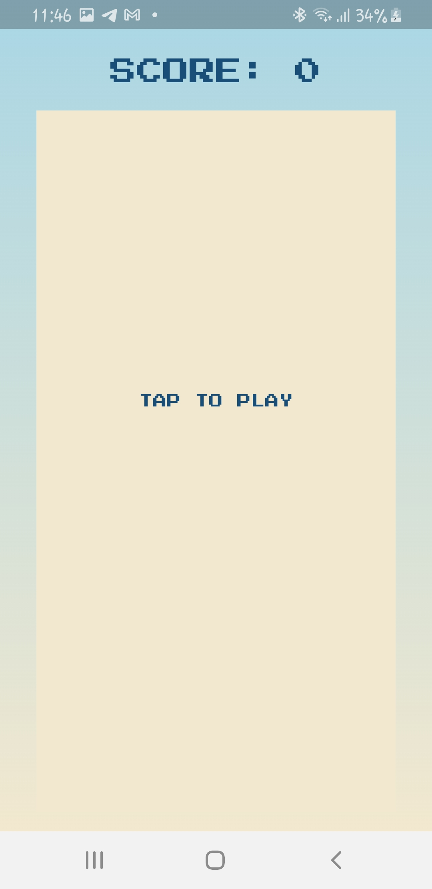
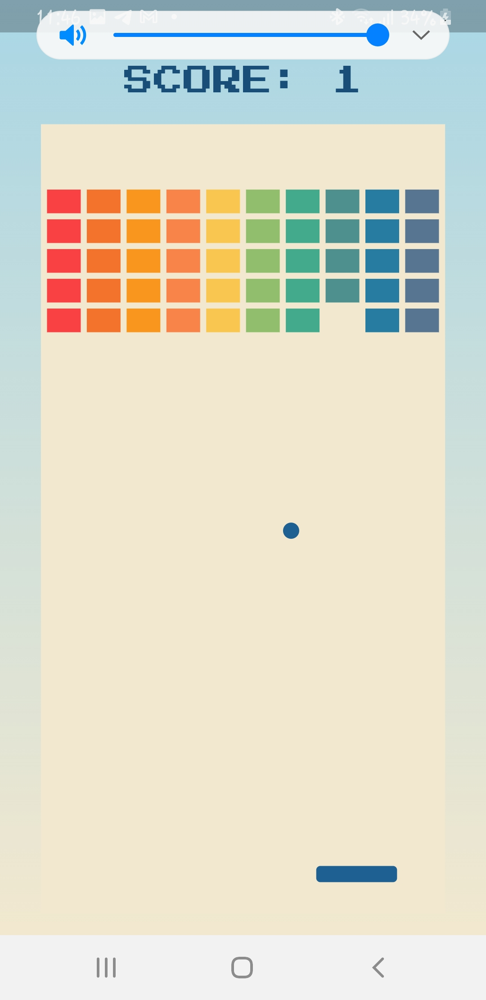

## brick_breacker

Flame est un moteur de jeu en 2D basé sur Flutter. Dans cet atelier de programmation, vous allez créer un jeu inspiré de l'un des classiques des jeux vidéo des années 70, Breakout de Steve Wozniak. j'utilise les composants de Flame pour dessiner la batte, la balle et les briques. j'utilise les effets de Flame pour animer le mouvement de la chauve-souris.


## Installation

1. Clone the repository:
    ```sh
    git clone https://github.com/hnk229/brick_breaker.git
    ```
2. Change to the project directory:
    ```sh
    cd brick_breacker
    ```
3. Get the dependencies:
    ```sh
    flutter pub get
    ```

## Running the App

1. Ensure a device is connected or an emulator is running.
2. Run the app:
    ```sh
    flutter run
    ```

## Features

- Classic Breakout gameplay
- Smooth animations using Flame effects
- Responsive controls


## License

This project is licensed under the MIT License - see the [LICENSE](LICENSE) file for details.

## Screenshots

Here are some screenshots of the game in action:

# Home Page Screen


# Game Screen

